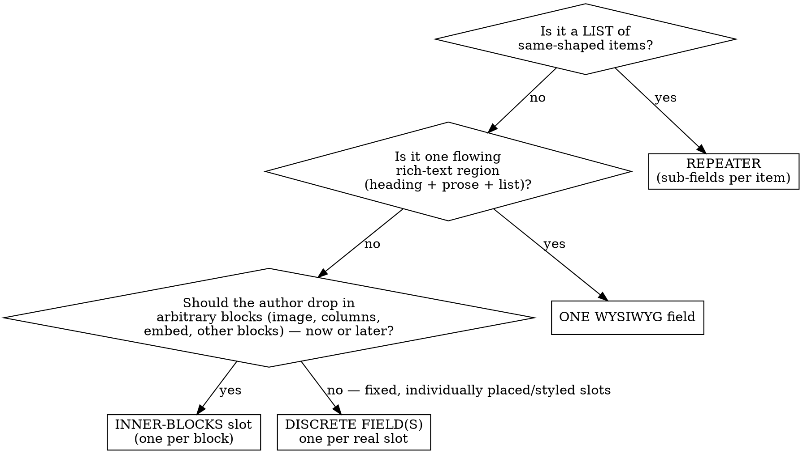

# Block Composition — how to model a content area

The single most common Proto-Blocks design mistake is **field proliferation**: chopping one authored region into many fields. If a block area needs "a heading, a paragraph, and a bullet list," the wrong answer is three fields (`text` + `wysiwyg` + something for the list). The right answer is **one** rich region — a `wysiwyg` field, or an `inner-blocks` slot.

Fields are not free. Each one is a fixed slot the author must fill in a fixed order. The more you add, the more rigid and tedious the block becomes — and the harder it is to change later. Reach for the *fewest, richest* regions that express the content.

## The decision



## The four tools

| Use | When | Value in PHP |
|-----|------|--------------|
| **Discrete field** (`text`, `image`, `link`) | A single, structurally-fixed slot you place and style **individually**: the block's main title (`h2`), a hero image, a CTA button. One field per *genuine* slot. | the field's own value |
| **One `wysiwyg` field** | A region that is **flowing rich text** — headings, paragraphs, lists, bold, links — authored as one blob, where you don't need to position or style the parts separately. | HTML string (`wp_kses_post`) |
| **`inner-blocks` slot** | The region should be **open-ended composition**: the author inserts arbitrary core/Proto blocks (paragraph, image, columns, quote, embed), now or in the future. Reuses existing blocks' editing UX instead of rebuilding it. **One per block.** | `$innerBlocksContent` (echo via `data-proto-inner-blocks`) |
| **`repeater`** | A **list of same-shaped items** (cards, stats, nav links, accordion rows), each a set of sub-fields. | array of item objects |

## The headline rule (your example)

> "This area needs a heading, an intro paragraph, and a bullet list."

- If it's **prose the author writes inline** and you don't style the parts separately → **one `wysiwyg` field**. A wysiwyg already supports headings, paragraphs, and lists. Do **not** create three fields.
- If the author should be able to **add an image, a quote, columns, etc. into that same area** (now or later) → **one `inner-blocks` slot**, constrained with `allowedBlocks` and seeded with a `template`. This is the "give an existing block a sub-fields/composition area" pattern — you graft open-ended composition onto the block instead of enumerating every possible field.

```json
"body": {
  "type": "inner-blocks",
  "allowedBlocks": ["core/heading", "core/paragraph", "core/list", "core/image", "core/quote"],
  "template": [
    ["core/heading", { "level": 3, "placeholder": "Heading" }],
    ["core/paragraph", { "placeholder": "Intro..." }],
    ["core/list"]
  ]
}
```

## wysiwyg vs inner-blocks — the tiebreaker

Both hold rich content; choose by **how open-ended** the region is and **what can go in it**.

| | `wysiwyg` | `inner-blocks` |
|---|-----------|----------------|
| Content | inline rich text: headings, paragraphs, lists, bold, links | any allowed **blocks**: images, columns, embeds, quotes, other Proto-Blocks |
| Authoring feel | one rich-text box | the full block editor, inside your block |
| Limit | none on count | **one inner-blocks field per block** |
| Output | `wp_kses_post($value)` | `echo $innerBlocksContent ?? ''` inside a `data-proto-inner-blocks` element |
| Reach for it when | "rich prose lives here" | "the author composes a section from blocks" |

Because you only get **one** inner-blocks slot per block, spend it on the region that genuinely needs free composition. Use `wysiwyg` for the rest.

## When discrete fields ARE right

Don't over-correct into "everything is inner-blocks." Use separate fields when each piece is a **distinct, individually-addressable slot** with its own placement, tag, styling, or control:

- A card: `image` + `title` (text, `h3`) + `body` (wysiwyg) + `link` — four real, differently-styled slots.
- A hero: `eyebrow` (text) + `heading` (text, `h1`) + `subheading` (wysiwyg) + an `inner-blocks` body for free content below.

The test: **do these pieces get placed/styled/controlled separately, or do they just flow together?** Separately → discrete fields. Flow together → one rich region.

## Field-proliferation smell test

You probably have too many fields if:
- Three or more `text`/`wysiwyg` fields always appear together, in document order, and none is individually styled or controlled → collapse into one `wysiwyg`.
- You're adding a new field every time the client wants "one more thing in that section" → that section wants an `inner-blocks` slot.
- A repeater item has a single rich sub-field doing heading+body+list → that sub-field should be a `wysiwyg` (or the item is really an inner-block).

Fewer, richer regions = a block that's easier to author, restyle, and evolve.
